**项目简介：**  
本项目基于主流的前后端分离架构，采用 **SpringBoot + Vue 技术栈**，配套 **MySQL 数据库**，适用于毕业设计与课题实训开发。  
本人已整理了超 **4000 多套毕业设计源码+论文+开题报告+PPT...**，涵盖 **Java、SpringBoot、Vue、SSM、uni-app 小程序、PHP、Android** 等方向，支持功能修改定制与论文服务。  
**团队提供以下服务：**  
- 项目代码修改与调试  
- 数据库配置与远程协助  
- 论文定制与修改  
**获取更多的4000多套源码或SQL文件请联系：**  
- QQ：3906443360 微信：BesheHelp

## springboot038基于SpringBoot的网上租赁系统设计与实现

**项目简介：**  
本项目基于主流的前后端分离架构，采用 **SpringBoot + Vue 技术栈**，配套 **MySQL 数据库**，适用于毕业设计与课题实训开发。  
本人已整理了超 **4000 多套毕业设计源码+论文+开题报告+PPT...**，涵盖 **Java、SpringBoot、Vue、SSM、uni-app 小程序、PHP、Android** 等方向，支持功能修改定制与论文服务。  
**团队提供以下服务：**  
- 项目代码修改与调试  
- 数据库配置与远程协助  
- 论文定制与修改  
**获取更多的4000多套源码或SQL文件请联系：**  
- QQ：3906443360 微信：BesheHelp**

# 系统实现与系统测试

# 第5章  系统的实现

5.1 用户功能模块的实现

5.1.1用户注册界面

没有账号的用户可进入注册界面进行注册操作，用户注册界面的运行效果如图5-1所示.

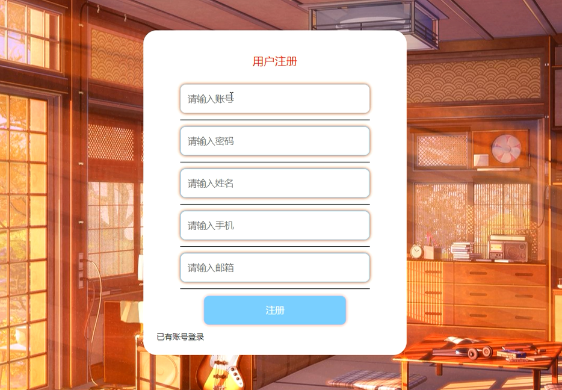

图5-1 用户注册界面

5.1.2用户登录界面

用户要想实现商品购买、租赁等操作，必须进行登录操作，在登录界面输入正确的用户名和密码，选择登录类型，点击登录按钮进行登录，用户登录界面如图5-2所示。

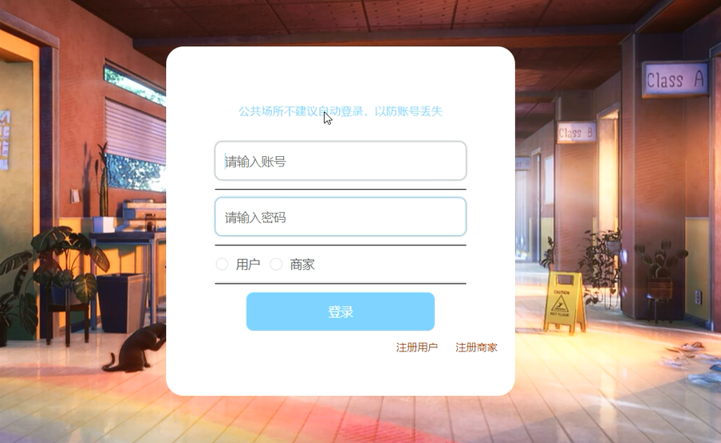

图5-2用户登录界面

5.1.3个人信息界面

用户登录后可对个人信息进行修改，个人信息界面的运行效果如图5-3所示.

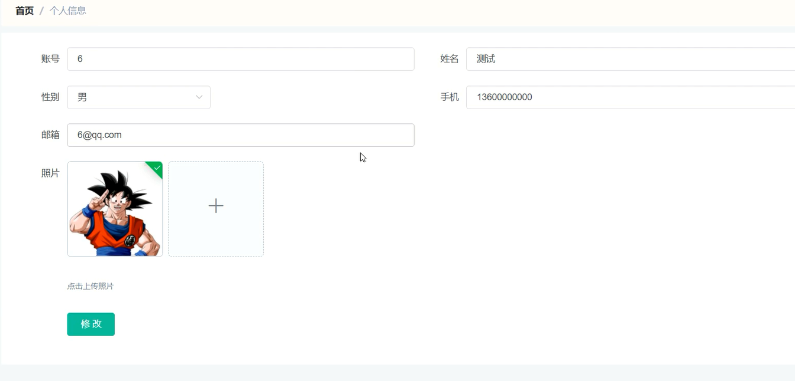

图5-3个人信息界面

5.1.4商品详情界面

用户可选择商品查看商品详情信息，登录后可进行加入购物车、租赁和购买操作，商品详情界面如图5-4所示。

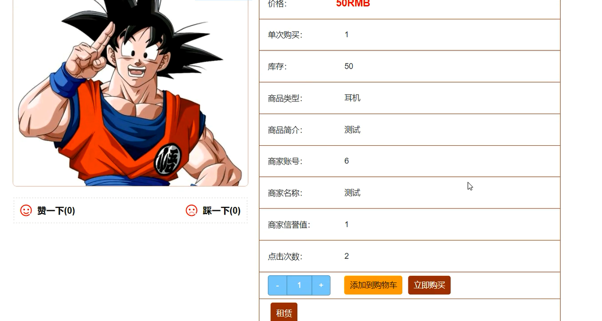

图5-4 商品详情界面

5.1.5购物车界面

用户在购物车界面可查看购物车商品信息，并可进行修改数量、删除商品以及购买等操作，购物车界面展示如图5-5所示。

图5-5 购物车界面

5.1.6订单信息界面

用户在订单信息界面可查看个人订单信息，订单信息界面如图5-6所示。

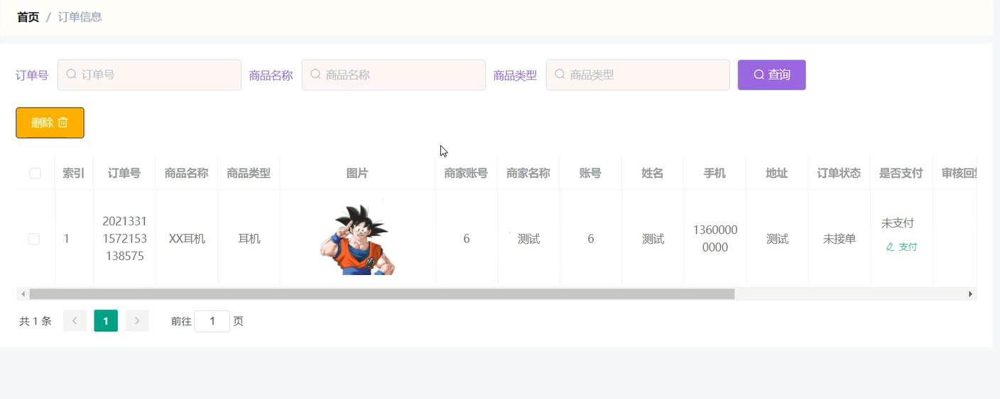

图5-6 订单信息界面

5.1.7发货订单界面

用户可查看个人发货订单信息，并可进行收货操作，发货订单界面如图5-7所示。

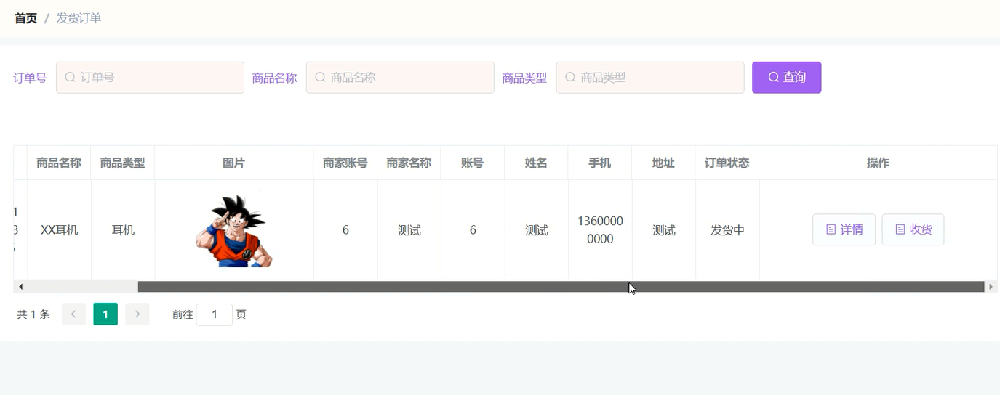

图5-7  发货订单界面

5.2 管理员功能模块的实现

5.2.1管理员登录界面

管理员要想进入系统后台对系统进行管理，首要进入登录界面，需通过正确的账号、密码进行登录操作，管理员登录界面如图5-8所示 。

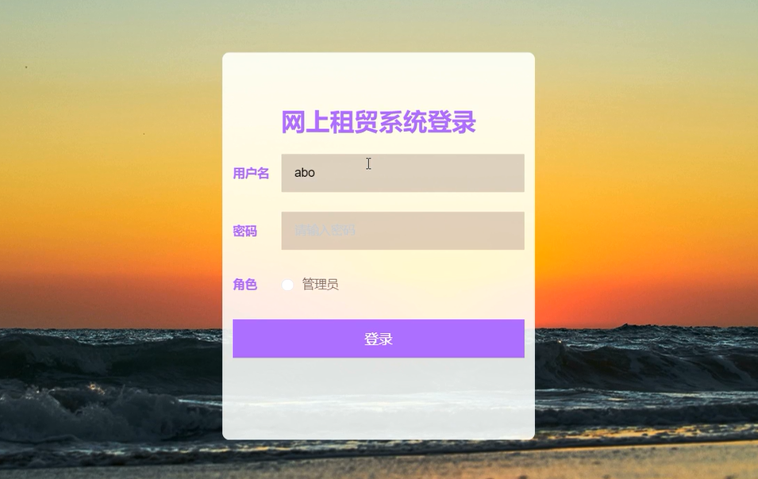

图5-8 管理员登录界面

5.2.2商家管理界面

管理员可增删改查商家信息，商家管理界面展示如图5-9所示 。

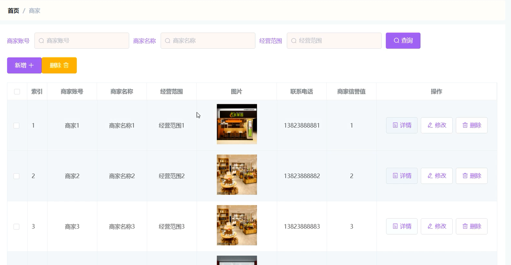

图5-9  商家管理界面

5.2.3用户管理界面

管理员可查看、修改和删除用户信息，并可新增用户，用户管理界面展示如图5-10所示 。

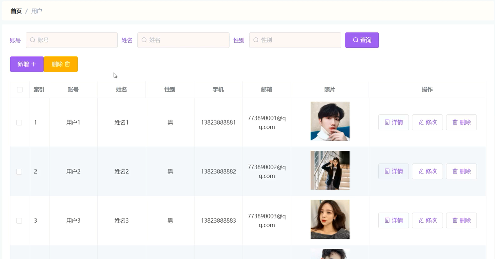

图5-10  用户管理界面

5.2.4商品分类管理界面

管理员可增删改查商品分类信息，商品分类界面展示如图5-11所示 。

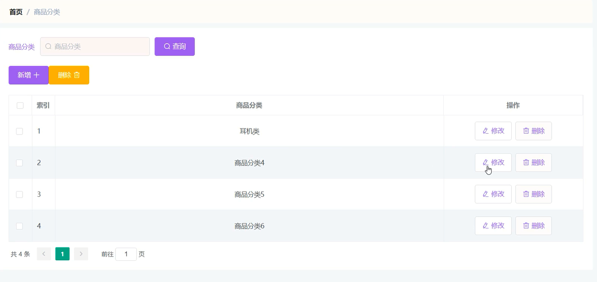

图5-11 商品分类管理界面

5.3 商家功能模块的实现

5.3.1商品信息管理界面

商家可添加、修改和删除商品信息，商品信息管理界面如图5-12所示。

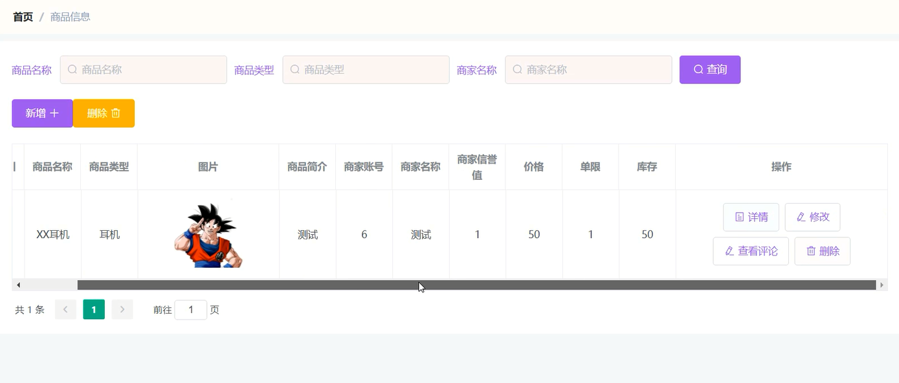

图5-12商品信息管理界面

5.3.2订单信息管理界面

商家可查看订单信息，并可对其进行审核、发货操作，订单信息管理界面展示如图5-13所示 。

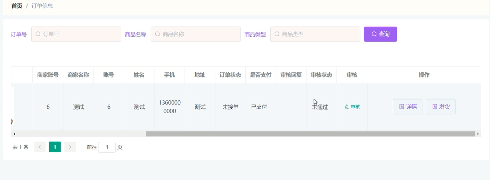

图5-13  订单信息管理界面

